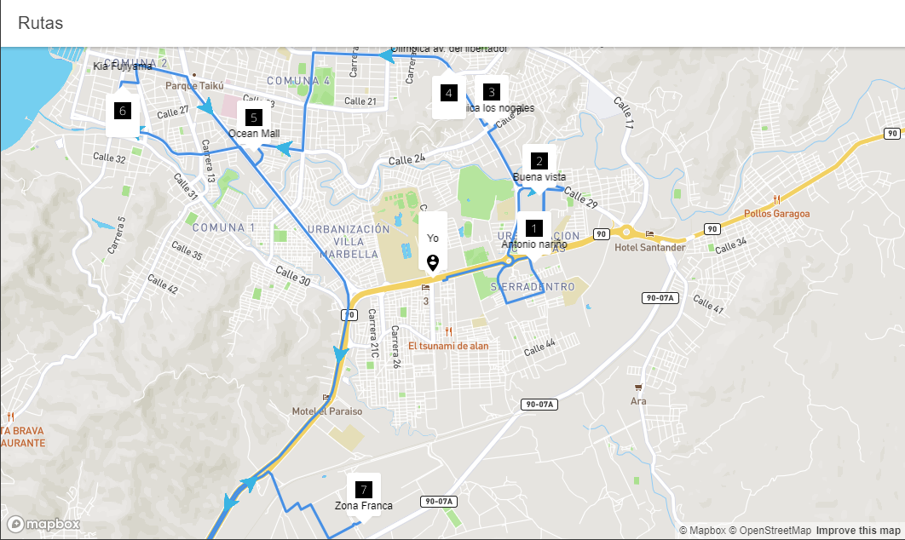

# ionic + react
### Dados X puntos identificados con latitud, longitud y un nombre, calcular la mejor ruta (basado en la distancia solamente) para recorrer estos puntos desde tu ubicación
---
# Correr el proyecto

### Primero es necesario setear la variable de entorno _REACT_APP_TOKEN_MAP_ con el token de MapBoxGL creando el archivo _.env_ en la raíz del proyecto

```
npm i
ionic serve
```

# Demo

[](#)

Hecho con ❤️ por [JoralmoPro](https://www.linkedin.com/in/joralmopro/)
